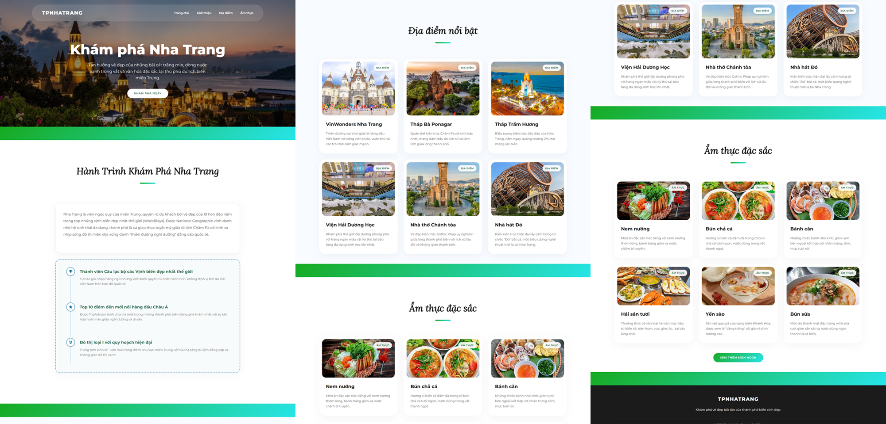

# 🌊 Khám phá Nha Trang - Thiên đường biển đảo

Một trang web du lịch nhằm giới thiệu vẻ đẹp và ẩm thực của thành phố biển Nha Trang - Việt Nam. Một trong những thành phố biển đẹp nhất Việt Nam.  



## ✨ Tính năng nổi bật

- **🎨 Thiết kế Glassmorphism**: Giao diện hiện đại sử dụng hiệu ứng kính mờ (Backdrop Blur) mang lại cảm giác cao cấp và thanh lịch.
- **📱 Responsive Design**: Tương thích hoàn toàn trên mọi thiết bị từ Desktop, Tablet đến Smartphone.
- **🎭 Hero Slider**: Hiệu ứng chuyển động mượt mà cho hình nền banner chính.
- **🧭 Navigation thông minh**: Menu di động dạng dropdown với hoạt ảnh phân tầng (staggered) và hiệu ứng nội dung trượt mượt mà.
- **🖼️ Modal chi tiết**: Hiển thị thông tin chi tiết về địa điểm/ẩm thực với bộ sưu tập hình ảnh, lịch sử và tích hợp bản đồ Google Maps.
- **✨ Hiệu ứng Scroll**: Các thành phần tự động fade-in khi người dùng cuộn tới.
- **🗂️ Phân loại nội dung**: Dễ dàng khám phá theo danh mục "Địa điểm" và "Ẩm thực".

## 🛠️ Công nghệ sử dụng

- **HTML5**: Cấu trúc nội dung chuẩn SEO và ngữ nghĩa.
- **CSS3 (Vanilla)**: Hệ thống grid/flexbox, biến CSS (variables) và các hiệu ứng animation phức tạp.
- **JavaScript (Vanilla)**: Xử lý logic slider, modal, filter và các sự kiện người dùng mà không cần thư viện bên ngoài.
- **Font Awesome**: Hệ thống icon đồng bộ.
- **Google Fonts**: Phông chữ Montserrat và Lora tinh tế.

## 🚀 Cách chạy dự án

1. Clone thư mục dự án về máy.
2. Mở tệp `index.html` bằng trình duyệt web bất kỳ.
3. Hoặc sử dụng Live Server trong VS Code để có trải nghiệm tốt nhất.

## 📁 Cấu trúc thư mục

```text
NhaTrang/
├── img/                # Hình ảnh địa điểm, ẩm thực và banner
├── index.html          # Trang chủ chính
├── script.js           # Xử lý logic Javascript
├── style.css           # Định dạng giao diện CSS
└── README.md           # Tài liệu hướng dẫn
```

---

Thiết kế và phát triển bởi **Dr.Gifter**.  

> 📌 Lưu ý: Tài liệu mang tính chất tham khảo đối với học sinh/sinh viên.

---
>Nếu cảm thấy thích thú, bạn có thể ủng hộ mình thông qua tài khoản này, để mình có thêm động lực tạo ra nhiều thứ hay hơn

<div align="center">
  
</div>
